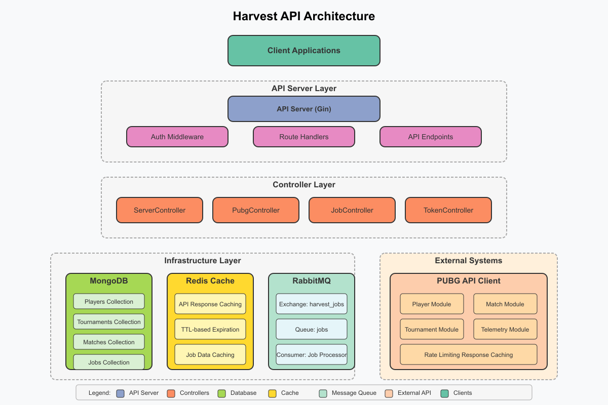

# Harvest API Architecture Documentation

## Overview

The Harvest API is designed as a modern, scalable system for collecting, processing, and managing PUBG game data. The architecture follows a clean separation of concerns with distinct layers for routing, business logic, data access, and external integration.

## Visual Architecture

The following diagram illustrates the Harvest API architecture and the relationships between its components:

This architecture diagram shows:

1. **Client Layer**: External applications that interact with the Harvest API
2. **API Server Layer**: The core server components including routing and authentication 
3. **Controller Layer**: Four main controllers (Server, PUBG, Job, and Token) that implement business logic
4. **Infrastructure Layer**: Data storage (MongoDB), caching (Redis), and message queueing (RabbitMQ)
5. **External Systems**: The PUBG API client as a separate external integration

The diagram uses consistent color coding to distinguish between different types of components:
- Blue components represent server elements
- Orange components represent controllers
- Green components represent database storage
- Yellow components represent caching
- Light green components represent message queuing
- Coral components represent external API integration

The architecture follows a clean separation of concerns with distinct layers for routing, business logic, data access, and external integration. The design maintains clear boundaries between components while showing their relationships.

## Architecture Components

### Client Layer
- **Client Applications**: External systems that interact with the API via HTTP requests
- **Authentication**: Bearer token-based authentication for secure API access

### API Server Layer
- **Router/Handler Layer**: Routes HTTP requests to the appropriate controller methods
- **Middleware**: Authentication and authorization middleware to validate tokens
- **Endpoints**: Grouped by functionality (Health, PUBG, Jobs, Tokens)

### Controller Layer
- **ServerController**: Health checks and system status monitoring
- **PubgController**: PUBG data operations (players, tournaments, matches)
- **JobController**: Background job management and monitoring
- **TokenController**: API token creation, validation, and management

### Service Layer
- **Job Processor**: Processes background jobs asynchronously
- **Processor Registry**: Registry of specialized job processors
- **Custom Processors**: Specific processors for player data, tournament data, etc.

### Data Access Layer
- **MongoDB**: Primary data storage for all entities
- **Redis**: Caching layer for improved performance
- **RabbitMQ**: Message queue for job distribution and processing

### External Integration Layer
- **PUBG API Client**: Custom client for interacting with the PUBG game API
- **Rate Limiting**: Controls request rate to avoid API throttling
- **Response Caching**: Caches API responses to reduce duplicate requests

## Data Flow

### API Request Flow
1. Client sends an authenticated HTTP request to the API server
2. Authentication middleware validates the token with TokenController
3. Request is routed to the appropriate controller method
4. Controller executes business logic, interacting with database and external services
5. Response is formatted and returned to the client

### Job Processing Flow
1. Client submits a job request via the API
2. JobController creates a job record in the database
3. Job message is published to RabbitMQ
4. Job processor consumes the message from the queue
5. Processor registry identifies the appropriate processor for the job type
6. Processor executes the job with appropriate batching strategy
7. Job status and results are updated in the database

### PUBG Data Flow
1. Client requests PUBG data operations via the API
2. PubgController initiates the operation
3. PUBG client makes rate-limited requests to the PUBG API
4. Responses are cached in Redis when appropriate
5. Data is processed and stored in MongoDB
6. Results are returned to the client

## Key Design Patterns

### Repository Pattern
- Database operations are abstracted through repository interfaces
- Allows for clean separation between business logic and data access

### Factory Pattern
- Used to create specific processor implementations for different job types
- Processor registry acts as a factory for job processors

### Command Pattern
- Jobs represent commands to be executed asynchronously
- Encapsulates all information needed to perform an operation

### Observer Pattern
- Job progress updates act as events that observers can monitor
- Enables real-time tracking of long-running operations

### Strategy Pattern
- Different processing strategies can be applied based on job type
- Batch processing strategies vary based on data characteristics

## Scalability Considerations

### Horizontal Scaling
- Stateless API servers can be deployed across multiple instances
- Database connections are pooled for efficient resource usage

### Vertical Partitioning
- Different types of data (players, matches, etc.) are stored in separate collections
- Enables optimization of query patterns for specific data types

### Asynchronous Processing
- Long-running operations are performed asynchronously via jobs
- Prevents blocking API responses while processing large datasets

### Caching Strategy
- Redis cache reduces load on the PUBG API
- TTL-based caching balances freshness with performance

## Security Measures

### Token-Based Authentication
- All API endpoints (except health checks) require authentication
- Tokens have role-based permissions (ADMIN vs SERVICE)

### Hashed Token Storage
- Token values are never stored in plain text
- SHA-256 hashing is used for secure token storage

### Token Revocation
- Tokens can be revoked immediately when compromised
- Revoked tokens cannot be used for future authentication

### Token Expiration
- Tokens can have expiration dates for time-limited access
- Expired tokens are automatically rejected

## Future Expansion

The architecture is designed to be extensible in several ways:

1. **Additional Processors**: New job types can be added by implementing new processors
2. **API Expansion**: New endpoints can be added to expose additional functionality
3. **Data Sources**: Integration with additional game data sources
4. **Analytics Pipeline**: Data aggregation and analysis capabilities

## Monitoring and Observability

- **Logging**: Structured logging using zerolog for better traceability
- **Health Checks**: Comprehensive health endpoints for infrastructure monitoring
- **Metrics**: Job metrics tracking processing performance
- **Error Handling**: Consistent error handling and reporting throughout the system